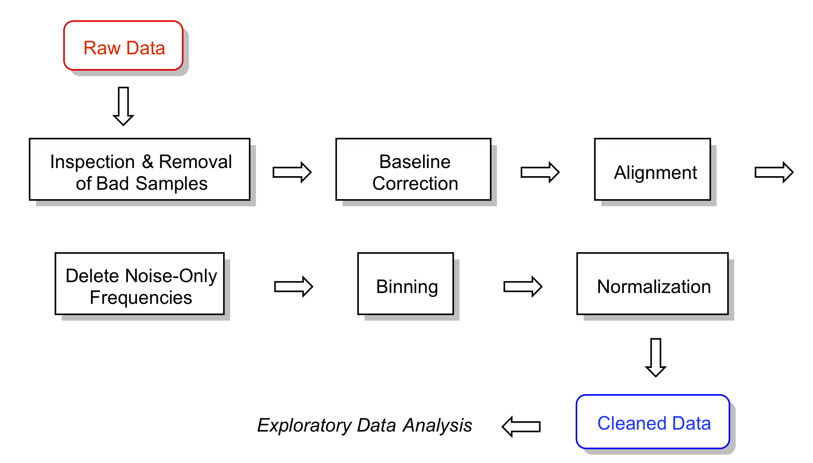
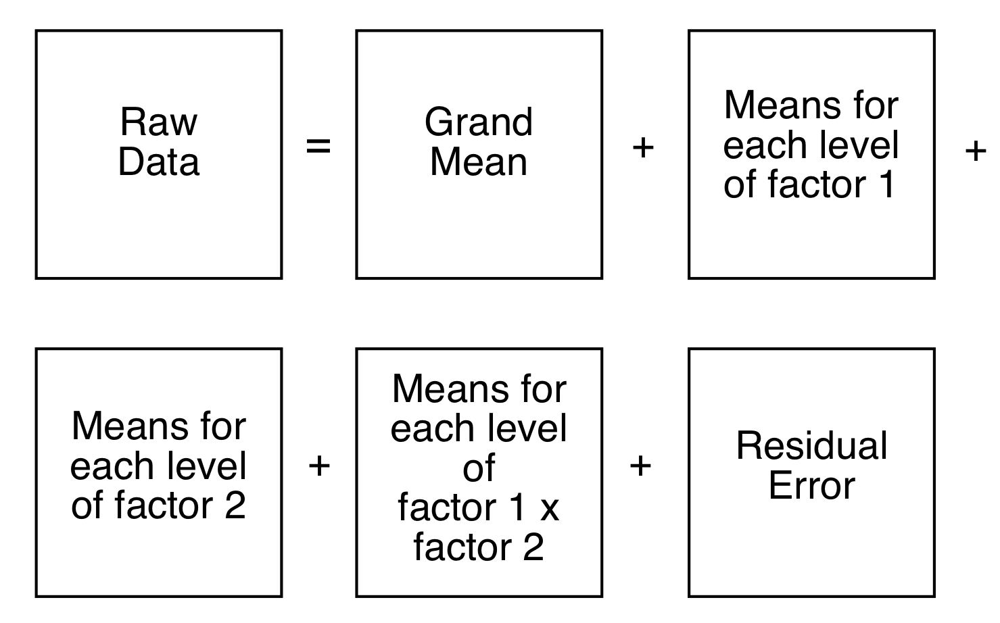
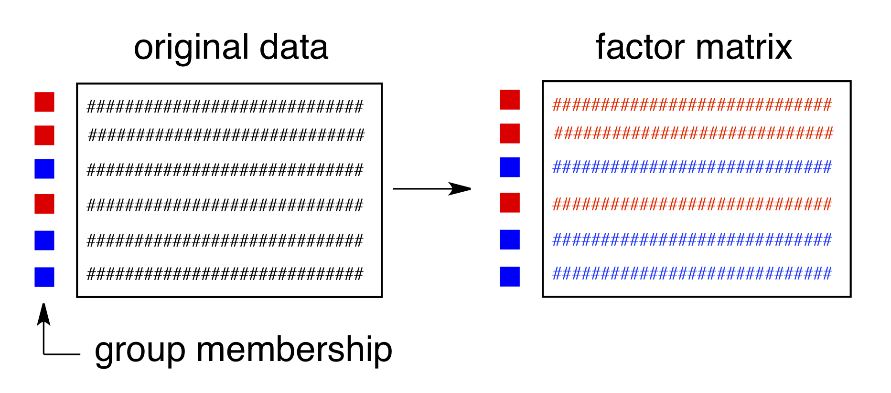

<!-- Run a few things in the background for use later -->

```{r SetUp, echo = FALSE, eval = TRUE, results = "hide"}

# R options & configuration:
set.seed(9)
rm(list = ls())
suppressMessages(library("knitr"))
suppressMessages(library("ChemoSpec"))
suppressMessages(library("mclust"))
suppressMessages(library("RColorBrewer"))

desc <- packageDescription("ChemoSpec")

# Stuff specifically for knitr:

# Create a temp bib file w/citations of installed pkgs, on the fly
knitr::write_bib(c("knitr", "mclust", "baseline", "hyperSpec"), file = "manuals.bib", prefix = "R_")

# Hook for figure size control
knitr::opts_hooks$set(sq.fig = function(options) {

  if (isFALSE(options$sq.fig)) {
    # custom fig dimensions given, use w/o further delay
    if ((!is.null(options$fig.width)) & (!is.null(options$fig.height))) return(options)
    # otherwise set the default wide aspect ratio
    if ((is.null(options$fig.width)) & (is.null(options$fig.height))) {
      options$fig.width = 6
      options$fig.height = 3.5
    }
  }

  if (isTRUE(options$sq.fig)) {
    options$fig.width = 5
    options$fig.height = 5
  }
  options
})

# choices here are designed to work with the hook
knitr::opts_chunk$set(fig.align = "center", sq.fig = FALSE,
  fig.width = NULL, fig.height = NULL, out.width = "80%")

```

This vignette is based upon `ChemoSpec` version `r desc$Version`.

> `ChemoSpec` is a collection of functions for top-down exploratory data analysis of spectral data including nuclear magnetic resonance (NMR), infrared (IR), Raman, X-ray fluorescence (XRF) and other similar types of spectroscopy. Includes functions for plotting and inspecting spectra, peak alignment, hierarchical cluster analysis (HCA), principal components analysis (PCA) and model-based clustering. Robust methods appropriate for this type of high-dimensional data are available. `ChemoSpec` is designed for structured experiments, such as metabolomics investigations, where the samples fall into treatment and control groups. Graphical output is formatted consistently for publication quality plots. `ChemoSpec` is intended to be very user friendly and to help you get usable results quickly. A vignette covering typical operations is available.


# Introduction

Chemometrics, as defined by Varmuza and Filzmoser [@Filzmoser2009], is


> "... the extraction of relevant information from chemical data by mathematical and statistical tools."

This is an appropriately broad definition, considering the wealth of questions and tasks that can be treated by chemometric approaches.  In our case, the focus is on spectral data sets, which typically have many variables (frequencies) and relatively few samples.  Such multivariate, _high p, low n_ data sets present some algorithmic challenges, but these have been addressed by knowledgeable folks.  In particular, for both the practical and theoretical background to multivariate chemometric analysis, I strongly recommend the Varmuza/Filzmoser book [@Filzmoser2009].  Some of the functions described here are not much more than wrappers for the functions they and others have made available to the `R` community in their packages.  Another excellent text is the one by Ron Wehrens [@Wehrens2011].

`ChemoSpec` was developed for the chemometric analysis of spectroscopic data, such as XRF [@Panchuk2018], UV-Vis, NMR or IR data, including MIR and NIR.  `ChemoSpec` also works with chromatographic data (see below) and less commonly encountered techniques such as circular dichroism).[^1] The purpose of `ChemoSpec` is to make chemometric tools readily available to a wide range of researchers who might be new to `R`.  The approach is entirely exploratory and unsupervised, in other words, "top-down" [@Wishart2007]. `ChemoSpec` is designed to accommodate samples that have different histories, i.e., they fall into different classes, categories or groups.  Examples would be treatment and control groups, or simply different specimens (red flowers vs. blue flowers).  `ChemoSpec` is designed to be as user friendly as possible, with plenty of error checking, helpful warnings and a consistent interface.  It also produces graphics that are consistent in style and annotation, and are suitable for use in publications and posters.  Careful attention was given to writing the documentation for the functions, but this vignette serves as the best starting point for learning data analysis with `ChemoSpec`. `ChemoSpec` is not intended to duplicate the work that is typically done on the spectrometer.

The centerpiece of `ChemoSpec` is the `Spectra` object.  This is the place where your data is stored and made available to `R`.  Once your data in stored this way and checked, all analyses are easily carried out.  `ChemoSpec` currently ships with several built-in data sets; we'll use one called `SrE.IR` for our demonstrations.  You will see in just a moment how to access it and inspect it.

I assume you have at least a bare-bones knowledge of `R` as you begin to learn `ChemoSpec`, and have a good workflow set up.  For detailed help on any function discussed here, type `?function_name` at the console.  If you type `?ChemoSpec` and click the index link at the bottom, you will see all the available functions, which is also convenient when you can't quite remember the name of a particular function.

Finally, some conventions for this document:  names of `R` "objects" such as packages, functions, function arguments, and data sets are in `typewriter` font as are `file names`.  The commands you issue at the console and the output are shown with a light grey background, and are colored according to use and purpose, courtesy of the excellent `knitr` package [@R_knitr].

By the way, if you try `ChemoSpec` and find it useful, have questions, have opinions, or have suggestions, please do let me know.  The version you are using already incorporates a great deal of user input, why not add yours?  Possible bugs and feature requests should be documented using the Github [issues](http://github.com/bryanhanson/ChemoSpec/issues) system.

# A Sample Workflow

This sample exploration is designed to illustrate a typical `ChemoSpec` workflow.  The point is to illustrate how to carry out the commands, what options are available and typically used, and the order in which one might do the analysis.

You may wish to put your versions of these commands into a script file that you can source as you go along.  This way you can easily make changes, and it will all be reproducible.  To do this, open a blank `R` document, and type in your commands.  Save it as something like `My_First_ChemoSpec.R`.  Then you can either cut and paste portions of it to the console for execution, or you can source the entire thing:

```{r eval = FALSE}
source("My_First_ChemoSpec.R")
```

A typical chemometrics workflow is illustrated in Figure \@ref(fig:workflow).  Depending upon the nature of your data, some of these steps may be irrelevant or may be omitted, and the order may need to be changed.  Examples are in the following sections.


```{r workflow, out.width = "80%", echo = FALSE, fig.cap = "A typical workflow.  For a given data set, some steps may be omitted and the order changed.  That is part of what is meant by exploratory data analysis!"}

```

# Getting Data into ChemoSpec

There are two means of importing raw data sets into `ChemoSpec`.  One is the function `files2SpectraObject`, which assumes that your raw data exist as separate files in a single directory, each file containing a frequency column and an intensity column.  A header row may or may not be present, and the data can be separated by any separation mark you like (typically comma, tab, semi-colon or space).  You may also use comma or period as the decimal mark.  These options permit data to be imported from files written by a wide variety of instruments using various conventions.[^2]  It is also possible to import files in the JCAMP-DX format.

The second function is `matrix2SpectraObject`, which assumes you have a single file containing a matrix of the data.  This matrix should have frequencies in the first column, and individual sample intensities in the remaining columns.  There must be a header row in the file, and it must contain the sample names (except the first entry, which marks the frequencies, is ignored).  Other than this requirement, you have all the flexibility described above.

Please be sure to read the help at `?files2SpectraObject` for the details, and be certain to pay special attention to the \ldots argument, as this is how your choice of header, separator, and decimal mark are conveyed to `read.table` which does the actual reading.

It's a very good practice to name your data files using a system that encodes any class membership.  For example, if your data set contains treatment and control groups, or any analogous class/group information, this information should be available via the file names.  The argument `gr.crit` will be the basis for a grep process on the file/sample names, and from there, each sample will be assigned to a group and be assigned a color as well.  If your samples don't fall into groups, that's fine too, but you still have to give `gr.crit` something to go on -- just give it one string that is common to all the file names.  Obviously, this approach encourages one to name the files as they come off the instrument with forethought as to how they will be analyzed, which in turn depends upon your experimental design.  Nothing wrong with having a plan!

The output of `files2SpectraObject` or `matrix2SpectraObject` is a `Spectra` object, which is `R`-speak for an object that contains not only your data, but other information about the data, as provided by you via the arguments to the function.

Here's a typical situation.  Let's say you had a folder containing 30 NMR files of flower essential oils.  Imagine that 18 of these were from one proposed subspecies, and 12 from another.  Further, let's pretend that the question under investigation has something to do with the taxonomy of these two supposed subspecies, in other words, an investigation into whether or not they should be considered subspecies at all.  If the files were named like `sspA1.csv` ... `sspA18.csv` and `sspB1.csv` ... `sspB12.csv` then the following command should process the files and create the desired `Spectra` object:

```{r results = "hide", eval = FALSE}
ssp <- files2SpectraObject(
  gr.crit = c("sspA", "sspB"),
  gr.cols = c("red", "blue"),
  freq.unit = "ppm",
  int.unit = "peak intensity",
  descrip = "Subspecies Study",
  out.file = "subsp")
```

This causes `files2SpectraObject` to inspect the file names for the strings `"sspA"` and `"sspB"` and use these to assign the samples into groups.  Samples in `sspA*.csv` files will be assigned the color red and `sspB*.csv` will be assigned blue (see Section \@ref(sec:colsymsec) for some suggestions about planning ahead on color choices, as well as `?colorSymbol`).   After running this command, a new file called `subsp.RData` will be in your directory, and and a `Spectra` object called `ssp` will be in your workspace read for exploration.  At a later date, you don't have to re-import your data, you can use the saved version and give it whatever name you like as follows (function `loadObject` is from package `R.utils`):

```{r results = "hide", eval = FALSE}
SubspeciesNMR <- loadObject("subsp.RData")
```

Now it is ready to use.


## Working with Chromatograms

While all the language in this vignette and in the package are geared toward analysis of spectra, `ChemoSpec` can also works quite well with chromatograms as the raw data.  In this case, time replaces frequency of course, but other than that the analysis is virtually the same.  So the only real difference is when you import the data, e.g. via `files2SpectraObject`, you will give the frequency unit along these lines: `freq.unit = "time (minutes)"`.

## Built-in Data Sets

`ChemoSpec` ships with several built-in data sets. `SrE.IR` is the set used for this vignette.  It is composed of a collection of 14 IR spectra of essential oil extracted from the palm _Serenoa repens_ or Saw Palmetto, which is commonly used to treat BPH in men.  The 14 spectra are of different retail samples, and are divided into two categories based upon the label description: adSrE, adulterated extract, and pSrE, pure extract.  The adulterated samples typically have olive oil added to them, which has no effect on BPH.  There are two additional spectra included as references/outliers: evening primrose oil, labeled EPO in the data set, and olive oil, labeled OO.  These latter two oils are mixtures of triglycerides for the most part, while the SrE samples are largely fatty acids.  As a result, the spectra of these two groups differ: the glycerides have ester carbonyl stretches and no O--H stretch, while the fatty acids have acid carbonyl stretches and an O--H stretch consistent with a carboxylic acid OH.

Also included is `SrE.NMR` which is the corresponding set of NMR spectra, and `CuticleIR`.  The latter is a series of IR spectra of the cuticle (leaf surface) of the plant _Portulaca oleracea_.  The data were taken by gently pinning the leaf against an ATR sampling device.  The plants were grown at two different temperatures, and two different genotypes (varieties) were used (a classic G x E, genotype by environment, experiment).

The `SrE.IR` data set is used as the example in this vignette as the sample spectra are fairly different and give good separation by most chemometric methods.  The `CuticleIR` spectra differ in much more subtle ways and as as result are more of a challenge to analyze.  For more details about these data sets, type `?data_set_name` at the console.


## Summarize the Data {#sec:prelim}

 _The_ first thing you should do, and this is very important, is to make sure your data are in good shape.  First, you can summarize the data set you created, and verify that the data ranges and other details look like you expect them to:

```{r}
data(SrE.IR) # makes the data available
sumSpectra(SrE.IR)
```

`sumSpectra` provides several pieces of information, and we'll discuss some of them as we go along.

# Plotting Spectra

Assuming that everything looks good so far, it's time to plot the spectra and inspect them.  A good practice would be to check every spectrum for artifacts and other potential problems.  There are three functions that can do this for you:

* `LoopThruSpectra` takes the pain out of inspecting quite a few spectra.  It shows you one spectrum at a time, and waits for a return to be typed in the console before proceeding.  See the help page for details.
* `plotSpectra` is intended for general use and publication-quality graphics.  You will generally have to play with the arguments a bit if plotting more than one spectrum.
* `plotSpectraJS` is the interactive version of `plotSpectra`.  It shows your data in a web page with the ability to offset the spectra and zoom as desired.  For really large data sets it may be slow; see the help page for ways to avoid that.

A basic plot using `plotSpectra` is shown in Figure \@ref(fig:sample-plot).  In this case we have chosen to plot one spectrum from each category.  Note that the carbonyl and C~sp2~-H regions are clearly different in these samples.

```{r sample-plot, fig.cap = "Sample plot."}
# We'll make a fancy title here
# and re-use in other plots
myt <- expression(
  bolditalic(Serenoa)~
  bolditalic(repens)~
  bold(Extract~IR~Spectra))
plotSpectra(SrE.IR,
  main = myt,
  which = c(1, 2, 14, 16),
  yrange = c(0, 1.6),
  offset = 0.4,
  lab.pos = 2200)
```

Depending upon the intensity range of your data set, and the number of spectra to be plotted, you have to manually adjust the arguments `yrange`, `offset` and `amplify`, but this usually only takes a few iterations.  Keep in mind that  `offset`, and `amplify` are multiplied in the function, so if you increase one, you may need to decrease the other.  Suppose that you wanted to focus just on the carbonyl region of these spectra; you can add the argument  `xlim`.  To demonstrate, let's look at fewer spectra, and at higher amplitude, so we can see details, as shown in Figure \@ref(fig:subplot).


```{r subplot, fig.cap = "Detail of the carbonyl region."}
plotSpectra(SrE.IR,
  main = myt,
  which = c(1, 2, 14, 16),
  yrange = c(0, 0.6),
  offset = 0.1,
  lab.pos = 1775,
  xlim = c(1650, 1800))
```

These sample plots display the IR spectra in two ways that may be upsetting to some readers: First, the x-axis is "backwards", because the underlying spectra were originally saved with an ascending frequency axis (which is not always the case).  This is readily fixed by supplying the `xlim`  argument in the desired order, e.g. `xlim = c(1800, 1650)` in the previous example.  Second, the vertical scale in these examples is absorbance.  When using IR for structural elucidation, the vertical axis is typically \%T, with the peaks pointing downward. However, absorbance mode is the appropriate one for chemometrics.  Record your original spectra that way and get used to it.

The argument `which` in `plotSpectra` takes a integer vector of the spectra you wish to plot--- you can think of this as the row number if you imagine each spectra to be a row in a matrix, with intensities in the columns (with each column corresponding to a particular frequency value).  You may be wondering how to determine which particular sample is in each row.  This is best accomplished with a grep command.  For instance, if you wanted to know what row/sample the olive oil was in, either of the following methods would locate it for you:

```{r}
# if there are only a few spectra
# show all of the names
SrE.IR$names
# if there are a lot of spectra,
# grep for the desired names
grep("OO", SrE.IR$names)
```

# Data Pre-Processing Options

There are a number of data pre-processing options available for your consideration.  The main choices are whether to normalize the data, whether to bin the data, and whether to scale the data.  Baseline correction is another typical action, and for some NMR data sets one might need to carry out aligment.  Data scaling is handled by the PCA routines, see Section \@ref(sec:pca).  @Engel2013 has a good discussion of pre-processing.  @Karakach2009 has a good discussion of error sources in ^1^H NMR data.

## Correcting Baseline Drift

`ChemoSpec` uses the functions in the package `baseline` to correct wandering baselines[@R_baseline].  The function, `baselineSpectra`, can show you the original and corrected baselines if desired, which is useful for choosing a method.  Figure \@ref(fig:baseline) shows a typical usage.  Method `rfbaseline` works well for IR spectra; `retC = TRUE` puts the corrected spectra into the new `Spectra` object so we can use it going forward (and we will).

```{r baseline, fig.cap = "Correcting baseline drift.", sq.fig = TRUE}
SrE2.IR <- baselineSpectra(SrE.IR,
  int = FALSE,
  method = "modpolyfit",
  retC = TRUE)
```

## Alignment

For ^1^H NMR data, it is sometimes desirable to align the spectra. This compensates in part for changes in dilution, ionic strength, or pH that can cause significant shifts for some types of protons. Spectra with broad, rolling peaks won't have this problem (UV-Vis or IR for example). `ChemoSpec` provides the `clupaSpectra` function for this purpose. You can see an example [here](http://www.validnmr.com/w/index.php?title=File:Wine_Alignment.png).

## Bucketing or Binning

Another type of pre-processing that you may wish to consider is binning or bucketing, in which groups of frequencies are collapsed into one frequency value, and the corresponding intensities are summed.  There are two reasons for doing this:

* Compacting large data sets:  This is a historical issue, the algorithms in `R` are quite fast, and large data sets don't really slow it down much.
* Compensating for ^1^H NMR shifts, as described above.

This example illustrates the process but is not necessary with IR data:

```{r}
tmp <- binSpectra(SrE.IR, bin.ratio = 4)
sumSpectra(tmp)
```

Compare the results here with the `sumSpectra` of the full data set (Section \@ref(sec:prelim)). In particular note that the frequency resolution has gone down due to the binning process.  `ChemoSpec` uses the simplest of binning algorithms: after perhaps dropping a few points (with a warning) to make your data set divisible by the specified `bin.ratio`, data points are replaced by the average frequency and the sum of the grouped intensities.  Depending upon the fine structure in your data and the `bin.ratio` this might cause important peaks to be split between different bins.  There are more sophisticated binning algorithms in the literature that try to address this, but none are currently implemented in `ChemoSpec` (@Anderson2008, @DeMeyer2008, @Sousa2013).  It's probably better to align the spectra as described above.

## Normalization

Normalization is handled by the `normSpectra` function.  Usually one normalizes data in which the sample preparation procedure may lead to differences in concentration, such as body fluids that might have been diluted during handling, or that vary due to the physiological state of the organism studied.  The `SrE.IR` data set is taken by placing the oil extract directly on an ATR device and no dilution is possible, so normalization isn't really appropriate.  Please see the help page for the normalization options.  The literature contains a number of useful discussions about normalization issues (@Craig2006 @Romano2000 @vandenBerg2006 @Filzmoser2009 @Zhang2009).

# Editing the Data Set \& Spectral Regions

In the process of plotting and inspecting your spectra, you may find some spectra/samples that have problems.  Perhaps they have instrumental artifacts.  Or maybe you have decided to eliminate one subgroup of samples from your data set to see how the results differ.

## Removing Individual Samples

To  remove a particular sample, or samples meeting a certain criteria, you use the `removeSample` function.  This function uses a grepping process based on its `rem.sam` argument, so you must be careful due to the greediness of grep.  Let's imagine that sample TD_adSrE has artifacts and needs to be removed.  The command would be:

```{r}
noTD <- removeSample(SrE2.IR,
  rem.sam = c("TD_adSrE"))
sumSpectra(noTD)
grep("TD_adSrE", noTD$names)
```

The `sumSpectra` command confirms that there are now one fewer spectra in the set.  As shown, you could also re-grep for the sample name to verify that it is not found.  The first argument in `grep` is the pattern you are searching for; if that pattern matches more than one name they will all be "caught."  For example if you used "SrE" as your pattern you would remove all the samples except the two reference samples, since "SrE" occurs in "adSrE" and "pSrE".  You can check this in advance with the grep function itself:

```{r}
SrE <- grep("SrE", SrE2.IR$names)
# show the name(s) that contain "SrE"
SrE2.IR$names[SrE]
SrE # gives the corresponding indices
```

This is what is meant by "grep is greedy".  In this situation, you have three choices:

* You could manually remove the problem samples (`str(SrE2.IR)` would give you an idea of how to do that; see also below under Hierarchical Cluster Analysis).
* `removeSample` also accepts indices of samples, so you could grep as above, note the index of the sample you actually want to remove, and use that in `rem.sam`.
* If you know a bit about grep and regular expressions, you can pass a more sophisticated search pattern to `rem.sam`.

## Removing Groups

`removeSample` uses the names of the samples (in `Spectra$names`) to identify and remove individual samples from the `Spectra` object.  There is also a function `removeGroup` which will remove samples belonging to a particular group in `Spectra$groups`.

## Identifying \& Removing Frequencies of No Interest

Many spectra will have regions that should be removed before analysis.  It may be an uninformative, interfering peak like the water peak in ^1^H NMR, or the CO~2~ peak in IR.  Or, there may be regions of the spectra that simply don't have much information -- they contribute a noisy baseline and not much else.  An example would be the region from about 1,800 or 1,900 cm^-1^ to about 2,500 cm^-1^ in IR, a region where there are typically no peaks except for the atmospheric CO~2~ stretch, and rarely (be careful!) alkyne stretches.

Finding these regions might be pretty simple, a matter of inspection coupled with your knowledge of spectroscopy.  Another approach is to use the function `surveySpectra` to examine the entire set of spectra.  This function computes a summary statistic (your choice) of the intensities at a particular frequency across the data set, as well as the mean or median.  In regions with little variation, the mean/median and upper/lower summary lines will be close together.  Figure \@ref(fig:survey-1) demonstrates the process.  There is also an alternative, `surveySpectra2` which presents the data in a slightly different format.  See Figure \@ref(fig:survey-2).


```{r survey-1, fig.cap = "Checking for regions of no interest."}
surveySpectra(SrE2.IR,
  method = "iqr",
  main = myt,
  by.gr = FALSE)
```

```{r survey-2, fig.cap = "Checking for regions of no interest."}
surveySpectra2(SrE2.IR,
  method = "iqr",
  main = myt)
```

In Figure \@ref(fig:survey-1) we kept all the groups together by using argument `by.gr = FALSE`.  We also looked at the entire spectral range.  In Figure \@ref(fig:survey-3) we can look just at the carbonyl region.  The black line is the median value of intensity across the entire set of spectra.  The red lines are the upper and lower interquartile ranges which makes it pretty clear that the carbonyl region of this data set varies a lot.


```{r survey-3, fig.cap = "Detail of carbonyl region."}
surveySpectra(SrE2.IR,
  method = "iqr",
  main = "Detail of Carbonyl Region",
  by.gr = FALSE,
  xlim = c(1650, 1800))
```

Finally, `surveySpectra` allows us to view the data set by group, which is really more useful.  Let's look at the carbonyl region by group (Figure \@ref(fig:survey-4)). Note that we get warnings because two of the groups have too few members to compute the interquartile range, and these are not shown.


```{r survey-4, fig.cap = "Detail of carbonyl region by group."}
surveySpectra(SrE2.IR,
  method = "iqr",
  main = "Detail of Carbonyl Region",
  by.gr = TRUE,
  xlim = c(1650, 1800))
```

For reasons that will become evident in a moment, let's look at the region between 1800 and 2500 cm^-1^ (Figure \@ref(fig:survey-5)).

```{r survey-5, fig.cap = "Inspection of an uninteresting spectral region."}
surveySpectra(SrE2.IR,
  method = "iqr",
  main = "Detail of Empty Region",
  by.gr = FALSE,
  xlim = c(1800, 2500),
  ylim = c(0.0, 0.05))
```

From a theoretical perspective, we expect this region to be devoid of interesting peaks.  In fact, even when pooling the groups the signal in this region is very weak, and the only peak present is due to atmospheric CO~2~.  We can remove this region, since it is primarily noise and artifact, with the function `removeFreq` as follows. Note that there are fewer frequency points now.[^3]

```{r}
SrE3.IR <- removeFreq(SrE2.IR,
  rem.freq = SrE2.IR$freq > 1800 &
  SrE2.IR$freq < 2500)
sumSpectra(SrE3.IR)
```

Notice that `sumSpectra` has identified a gap in the data set.  You can see this gap in the data as shown in Figure \@ref(fig:gaps) (`sumSpectra`  checks for gaps, but doesn't produce the plot); both the numerical results and a figure are provided.


```{r gaps, fig.cap = "Identifying gaps in a data set."}
check4Gaps(SrE3.IR$freq, SrE3.IR$data[1,])
```

# Exploratory Data Analysis

## Hierarchical Cluster Analysis {#sec:hca}

 Hierarchical cluster analysis (HCA from  now on) is a clustering method (no surprise!) in which "distances" between samples are calculated and displayed in a dendrogram (a tree-like structure; these are also used in evolution and systematics where they are called cladograms).  The details behind HCA can be readily found elsewhere (Chapter 6 of @Filzmoser2009 is a good choice).  With `ChemoSpec` you have access to any of the methods available for computing distances between samples and any of the methods for identifying clusters.  A typical example is shown in Figure \@ref(fig:hca-1).


```{r hca-1, fig.cap = "Hierarchical cluster analysis.", sq.fig = TRUE}
HCA <- hcaSpectra(SrE3.IR, main = myt)
```

The result is a dendrogram.  The vertical scale represents the numerical distance between samples.  Not unexpectedly, the two reference samples which are known to be chemically different cluster together separately from all other samples.  Perhaps surprisingly, the various pure and adulterated oil extracts do not group together precisely.  The function `hcaScores` does the same kind of analysis using the results of PCA, rather than the raw spectra.  It is discussed in the next section.

## Principal Components Analysis {#sec:pca}

 Principal components analysis (PCA from now on) is the real workhorse of exploratory data analysis.  It makes no assumptions about group membership, but clustering of the resulting sample scores can be very helpful in understanding your data.  The theory and practice of PCA is covered well elsewhere (Chapter 3 of @Filzmoser2009 is an excellent choice).  Here, we'll concentrate on using the PCA methods in `ChemoSpec`.  Briefly however, you can think of PCA as determining the minimum number of components necessary to describe a data set, in effect, removing noise and redundant information.  Think of a typical spectrum:  some regions are clearly just noise.  Further, a typical spectroscopic peak spans quite a few frequency units as the peak goes up, tops out, and then returns to baseline.  Any one of the points in a particular peak describe much the same thing, namely the intensity of the peak.  Plus, each frequency within a given peak envelope is correlated to every other frequency in the envelope (they rise and fall in unison as the peak changes size from sample to sample).  PCA can look "past" all the noise and underlying correlation in the data set, and boil the entire data set down to essentials.  Unfortunately, the principal components that are uncovered in the process don't correspond to anything concrete, usually.  Again, you may wish to consult a more detailed treatment!

Table \@ref(tab:opt) gives an overview of the options available in `ChemoSpec`, and the relevant functions.

<!-- column 2 starts at 40; column 3 starts at 85-->

: **(\#tab:opt)** PCA Functions

-------------------------------------- -------------------------------------------- -----------
**PCA options**                        **scaling options**                          **function**
classical PCA                          no scaling, autoscaling, Pareto scaling      `c_pcaSpectra`
robust PCA                             no scaling, median absolute deviation        `r_pcaSpectra`
sparse PCA                             no scaling, autoscaling, Pareto scaling      `s_pcaSpectra`
IRLBA PCA                              no scaling, autoscaling, Pareto scaling      `irlba_pcaSpectra`
**Diagnostics**                                                                     **function**
OD plots                                                                            `pcaDiag`
SD plots                                                                            `pcaDiag`
**Choosing the correct no. of PCs**                                                 **function**
scree plot                                                                          `plotScree`
bootstrap analysis (classical PCA only)                                             `cv_pcaSpectra`
**Score plots**                        **plotting options**                         **function**
2D plots                               robust or classical confidence ellipses      `plotScores`
3D plots
---static 3D plots                                                                  `plotScores3D`
---interactive 3D plots                                                             `plotScoresRGL`
**Loading plots**                                                                   **function**
loadings vs frequencies                                                             `plotLoadings`
loadings vs other loadings                                                          `plot2Loadings`
s-plot (correlation vs covariance)                                                  `sPlotSpectra`
**Other**                                                                           **functions**
HCA of PCA scores                                                                   `hcaScores`
ANOVA-PCA                                                                           `aov_pcaSpectra`
-------------------------------------- -------------------------------------------- -----------


There's quite a bit of choice here; let's work through an example and illustrate, or at least mention, the options as we go.  Keep in mind that it's up to you to decide how to analyze your data.  Most people try various options, and follow the ones that lead to the most insight.  But the decision is yours!

The first step is to carry out the PCA.  You have two main options, either classical methods, or robust methods.  Classical methods use all the data you provide to compute the scores and loadings.  Robust methods focus on the core or heart of the data, which means that some samples may be downweighted.  This difference is important, and the results from the two methods may be quite different, depending upon your the nature of your data.  The differences arise because PCA methods (both classical and robust) attempt to find the components that explain as much of the variance in the data set as possible.  If you have a sample that is genuinely corrupted, for instance due to sample handling, its spectral profile may be very different from all other samples, and it can legitimately be called an outlier.  In classical PCA, this one sample will contribute strongly to the variance of the entire data set, and the PCA scores will reflect that (it is sometimes said that scores and loadings follow the outliers).  With robust PCA, samples with rather different characteristics do not have as great an influence, because robust measures of variance, such as the median absolute deviation, are used.

Note that neither `c_pcaSpectra` nor `r_pcaSpectra` carry out any normalization by samples.  You need to decide if you want to normalize the samples, and if so, use `normSpectra`.

Besides choosing to use classical or robust methods, you also need to choose a scaling method.  For classical PCA, your choices are no scaling, autoscaling, or Pareto scaling.  In classical analysis, if you don't scale the data, large peaks contribute more strongly to the results.  If you autoscale, then each peak contributes equally to the results (including noise "peaks").  Pareto scaling is a compromise between these two.  For robust PCA, you can choose not to scale, or you can scale according to the median absolute deviation.  Median absolute deviation is a means of downweighting more extreme peaks.  The literature has plenty of recommendations about scaling options appropriate for the type of measurement (instrument) as well as the nature of the biological data set (@Zhang2009 @Craig2006 @Romano2000 @vandenBerg2006 @Filzmoser2009 @Karakach2009).

There is not enough space here to illustrate all possible combinations of options; Figure \@ref(fig:classPCA) and Figure \@ref(fig:robPCA) show the use and results of classical and robust PCA without scaling, followed by plotting of the first two PCs (we'll discuss plotting options momentarily).  You can see from these plots that the robust and classical methods have produced rather different results, not only in the overall appearance of the plots, but in the amount of variance explained by each PC.

Since we've plotted the scores to see the results, let's mention a few features of `plotScores` which produces a 2D plot of the results (we'll deal with 3D options later).  Note that an annotation is provided in the upper left corner of the plot that describes the history of this analysis, so you don't lose track of what you are viewing.  The `tol` argument controls what fraction of points are labeled with the sample name.  This is a means of identifying potential outliers.  The `ellipse` argument determines if and how the ellipses are drawn (the 95\% confidence interval is used).

You can choose `"none"` for no ellipses, `"cls"` for classically computed confidence ellipses, `"rob"` for robustly computed ellipses, or `"both"` if you want to directly compare the two.  Note that the use of classical and robust here has nothing to do with the PCA algorithm --- it's the same idea however, but applied to the 2D array of scores produced by PCA.  Points outside the ellipses are more likely candidates for outlier status.


```{r classPCA, fig.cap = "Classical PCA scores.", sq.fig = TRUE}
c_res <- c_pcaSpectra(SrE3.IR,
  choice = "noscale")
plotScores(SrE3.IR, c_res,
  main = myt,
  pcs = c(1,2),
  ellipse = "rob",
  tol = 0.01)
```

```{r robPCA, fig.cap = "Robust PCA scores.", sq.fig = TRUE}
r_res <- r_pcaSpectra(SrE3.IR,
  choice = "noscale")
plotScores(SrE3.IR, r_res,
  main = myt,
  pcs = c(1,2),
  ellipse = "rob",
  tol = 0.01)
```

Plots such as shown in Figures \@ref(fig:classPCA) and \@ref(fig:robPCA) can give you an idea of potential outliers, but `ChemoSpec` includes more sophisticated approaches.  The function `pcaDiag` can produce two types of plots that can be helpful (Figures \@ref(fig:OD) and \@ref(fig:SD)).  The meaning and interpretation of these plots is discussed in more detail in Varmuza and Filzmoser, Chapter 3 [@Filzmoser2009].


```{r OD, fig.cap = "Diagnostics: orthogonal distances.", sq.fig = TRUE}
diagnostics <- pcaDiag(SrE3.IR, c_res,
  pcs = 2,
  plot = "OD")
```

```{r SD, fig.cap = "Diagnostics: score distances.", sq.fig = TRUE}
diagnostics <- pcaDiag(SrE3.IR, c_res,
  pcs = 2,
  plot = "SD")
```

Depending upon your data, and your interpretation of the results, you may decide that some samples should be discarded, in which case you can use `removeSample` as previously described, then repeat the PCA analysis.  The next step for most people is to determine the number of PCs needed to describe the data.  This is usually done with a scree plot as shown in Figure \@ref(fig:scree-1).  `ChemoSpec` defaults to an alternate style scree plot which I actually think is much more informative (Figure \@ref(fig:scree-2) shows a more traditional scree plot).

If you are using classical PCA, you can also get a sense of the number of PCs needed via a bootstrap method, as shown in Figure \@ref(fig:boot). Note that this method is iterative and takes a bit of time.  Comparing these results to the scree plots, you'll see that the bootstrap method suggests that 4 or 5 PCs would not always be enough to reach the 95\% level, while the scree plots suggest that 2 PC are sufficient.


```{r scree-1, fig.cap = "Scree plot."}
plotScree(c_res, main = myt)
```

```{r scree-2, fig.cap = "Traditional style scree plot."}
plotScree(c_res, style = "trad", main = myt)
```

```{r boot, fig.cap = "Bootstrap analysis for no. of principal components.", sq.fig = TRUE}
out <- cv_pcaSpectra(SrE3.IR,
  pcs = 5)
```

Now let's turn to viewing scores in 3D.  There are currently two options in `ChemoSpec`: plotting using `lattice` graphics, which produces a static plot that you have to adjust manually, and an interactive plot based on package `rgl`.  Probably the best place to start is with `plotScoresRGL`.  It it well suited to exploring data, and can be printed out in high quality.  However, the nature of the `openGL` graphics device means that the title and the legend move with the data, so this may not give a hardcopy suitable for publications.  This interactive plot cannot be invoked in this document, but here are the necessary commands:

```{r results = "hide", eval = FALSE}
plotScoresRGL(SrE3.IR, c_res,
  main = "S. repens IR Spectra",
  leg.pos = "A",
  t.pos = "B") # not run - it's interactive!
```

For full details, of course take a look at the manual page, `?plotScoresRGL`.  If you want a similar and probably more publication-worthy plot, you can use `plotScores3D` as shown in Figure \@ref(fig:scores3D).  In this example we've set `ellipse = FALSE` because the "adSrE" data points form a very elongated ellipse which forces the plotting limits in such a way that other points become very hard to see.


```{r scores3D, fig.cap = "Plotting scores in 3D using plotScores3D.", sq.fig = TRUE}
plotScores3D(SrE3.IR, c_res,
  main = myt,
  ellipse = FALSE)
```

In addition to the scores, PCA also produces loadings which tell you how each variable (frequencies in spectral applications) affect the scores.  Examining these loadings can be critical to interpreting your results.  Figure \@ref(fig:load1) gives an example.  You can see that the different carbonyl peaks have a large and opposing effect on PC 1.  PC 2 on the other hand is driven by a number of peaks, with some interesting opposing peaks in the hydrocarbon region.  While the actual analysis of the data is not our goal here, it would appear that PC 1 is sensitive to the ester vs. acid carbonyl group, and PC 2 is detecting the saturated vs. unsaturated fatty acid chains (the latter having C~sp2~-H}$ peaks).


```{r load1, fig.cap = "Loading plot.", sq.fig = TRUE}
plotLoadings(SrE3.IR, c_res,
  main = myt,
  loads = c(1, 2),
  ref = 1)
```

You can also plot one loading against another, using function `plot2Loadings` (Figure \@ref(fig:load2)).  This is typically not too useful for spectroscopic data, since many of the variables are correlated (as they are parts of the same peak, hence the serpentine lines in the figure).  The most extreme points on the plot, however, can give you an idea of which peaks (frequencies) serve to differentiate a pair of PCs, and hence, drive your data clustering.


```{r load2, fig.cap = "Plotting one loading vs. another.", sq.fig = TRUE}
res <- plot2Loadings(SrE3.IR, c_res,
  main = myt,
  loads = c(1, 2),
  tol = 0.002)
```

However, a potentially more useful approach is to use an s-plot to determine which variables have the greatest influence.  A standard loadings plot (`plotLoadings`) shows you which frequency ranges contribute to which principal components, but the plot allows the vertical axis to be free.  Unless you look at the y axis scale, you get the impression that the loadings for principal component 1 etc. all contribute equally.  The function `sPlotSpectra` plots the correlation of each frequency variable with a particular score against the covariance of that frequency variable with the same score.  The result is an s-shaped plot with the most influential frequency variables in the upper right hand and lower left quadrants.  An example is shown in Figure \@ref(fig:splot-1) with a detail view in Figure \@ref(fig:splot-2).  In the latter figure you can clearly see the influence of the carbonyl peaks.  This method was reported in @Wiklund2008.


```{r splot-1,  fig.cap = "s-Plot to identify influential frequencies.", sq.fig = TRUE}
spt <- sPlotSpectra(SrE3.IR, c_res,
  main = myt,
  pc = 1,
  tol = 0.001)
```

```{r splot-2,  fig.cap = "s-Plot detail.", sq.fig = TRUE}
spt <- sPlotSpectra(SrE3.IR, c_res,
  main = "Detail of s-Plot",
  pc = 1,
  tol = 0.05,
  xlim = c(-0.04, -0.01),
  ylim = c(-1.05, -0.9))
```

Finally, you can blend the ideas of PCA and HCA.  Since PCA eliminates the noise in a data set (after you have selected the important PCs), you can carry out HCA on the PCA scores, as now the scores represent the cleaned up data.  The result using the `SrE.IR` data set are not different than doing HCA on the raw spectra, so we won't illustrate it, but the command would be:

```{r results = "hide", eval = FALSE }
hcaScores(SrE3.IR,  c_res,
  scores = c(1:5),
  main = myt)
```

## ANOVA-PCA

Harrington _et al._[@Harrington2005] (and a few others -- @Pinto2008) have demonstrated a method which combines traditional ANOVA with PCA.  Standard PCA is blind to class membership, though one generally colors the points in a score plot using the known class membership.  ANOVA-PCA uses the class membership to divide the original centered data matrix into submatrices.  Each submatrix corresponds to a particular factor, and the rows of the submatrix have been replaced by the average spectrum of each level of the factor.  The original data set is thought of as a sum of these submatrices plus residual error.  The residual error is added back to each submatrix and then PCA is performed.  This is conceptually illustrated in Figures \@ref(fig:aovPCA2) and \@ref(fig:aovPCA1).

```{r aovPCA2, out.width = "80%", echo = FALSE, fig.cap = "aovPCA breaks the data into a series of submatrices."}

```

```{r aovPCA1, out.width = "80%", echo = FALSE, fig.cap = "Submatrices are composed of rows which are averages of each factor level."}

```

ANOVA-PCA has been implemented in `ChemoSpec` via the functions `aov_pcaSpectra`, `aovPCAscores` and `aovPCAloadings`.  The idea here is that if a factor is significant, there will be separation along PC1 in a plot of PC1 vs PC2.  There are not enough groups and levels within the `SrE.IR` data set to carry out ANOVA-PCA.  However, the help page for `aov_pcaSpectra` contains an example using the `CuticleIR` data set which illustrates how to carry out the analysis.  It also demonstrates another useful function, `splitSpectraGroups` which allows you to take an existing group designation and split it into new designations.  See `?aov_pcaSpectra`.

## Model-Based Clustering Using mclust

PCA and HCA are techniques which are unsupervised and assume no underlying model.  HCA computes distances between pairs of spectra and groups these in an iterative fashion until the dendrogram is complete.  PCA seeks out components that maximize the variance.  While in PCA one often (and `ChemoSpec` does) displays the samples coded by their group membership, this information is not actually used in PCA; any apparent correspondence between the sample group classification and the clusters found is accidental in terms of the computation, but of course, this is what one hopes to find!

`mclust` is a model-based clustering package that takes a different approach[@R_mclust].  `mclust` assumes that there are groups within your data set, and that those groups are multivariate normally distributed.  Using an iterative approach, `mclust` samples various possible groupings within your data set, and uses a Bayesian Information Criterion (BIC) to determine which of the various groupings it finds best fits the data distribution. `mclust` looks for groups that follow certain constraints, for instance, one constraint is that all the groups found must have a spherical distribution of data points, while another allows for ellipsoidal distributions.  See the paper by Scrucca and Raftery [@Scrucca2017] for more details.  The basic idea however is that `mclust` goes looking for groups in your data set, and then you can compare the groupings it finds with the groupings you know to be true.

`ChemoSpec` contains several functions that interface with and extend `mclust` functions.  `mclust` first uses the BIC to determine which model best fits your data; these results are shown in Figure \@ref(fig:mclust-1).  Next, Figure \@ref(fig:mclust-2) shows the groups that `mclust` finds in the data.  It's of some interest to visually compare the score plot in Figure \@ref(fig:classPCA) with the `mclust` results in Figure \@ref(fig:mclust-2).  It looks like `mclust` groups the two outliers with some of the rest of the data.  Next, `mclust` will map the true groups onto the groups it has found.  Points in error are X-ed out.  These results can be seen in Figure \@ref(fig:mclust-3).  From this plot, you can see that `mclust` hasn't done too well with this data set.  In general, you have to be very careful about using `mclust`'s notion of an error:  it is very hard to map the found groups onto the "truth" in an algorithmic way.  I lean toward not using the "truth" option in `mclust` more and more.


```{r  mclust-1, fig.cap = "mclust chooses an optimal model.", results = "hide", sq.fig = TRUE}
model <- mclustSpectra(SrE3.IR, c_res,
  plot = "BIC",
  main = myt)
```

```{r mclust-2, fig.cap = "mclust's thoughts on the matter.", results = "hide", sq.fig = TRUE}
model <- mclustSpectra(SrE3.IR, c_res,
  plot = "proj",
  main = myt)
```

```{r mclust-3, fig.cap = "Comparing mclust results to the TRUTH.", results = "hide", sq.fig = TRUE}
model <- mclustSpectra(SrE3.IR, c_res,
  plot = "errors",
  main = myt,
  truth = SrE3.IR$groups)
```

You can also do a similar analysis in 3D, using `mclust3dSpectra`.  This function uses `mclust` to find the groups, but then uses non-`mclust` functions to draw confidence ellipses.  This function uses `rgl` graphics so it cannot demonstrated here, but the commands would be:

```{r results = "hide", eval = FALSE }
# not run - it's interactive!
mclust3dSpectra(SrE3.IR, c_res)
```

You have all the options here that you do with `plotScoresRGL`, namely, classical, robust or no ellipses, control of the ellipse details, and labeling of extreme points.

I hope you have enjoyed this tour of the features of `ChemoSpec`!

# Appendicies

## Functions That Are Not Discussed Here

See the help files for more detail.

* `splitSpectraGroups`: A good example of its use can be found in `?aov_pcaSpectra`.
* `hypTestScores`: Run anova on PCA scores.
* `hmapSpectra`: Plot a seriated heat map.
* `evalClusters`: Compare various clustering options.
* `sgfSpectra`: Apply Savitzky-Golay filters.
* `plotSpectraDist`: Plot the distance between each spectrum and a reference spectrum.

## Color and Symbol Options {#sec:colsymsec}

In `ChemoSpec`, the user may use any color name/format known to `R`.  When importing data, `ChemoSpec` will choose colors for you automatically if desired.  However, depending upon your needs, you may wish to choose colors yourself.  the current color scheme of a `Spectra` object may be determined using `sumSpectra` or changed using `conColScheme`. A fuller discussion of color issues can be found in `?colorSymbol`.

In addition to colors, `Spectra` objects also contain a list of symbols, and alternative symbols.  These are useful for plotting in black and white, or when color-blind individuals will be viewing the plots.  The alternative symbols are simply lower-case letters, as these are needed for `plotScoresRGL`, and other rgl-graphics driven functions which cannot plot traditional symbols.  Figure \@ref(fig:colsym) shows some of the built in options, but as stated above, you can choose whatever you like.

```{r colsym, echo = FALSE, fig.cap = "Color and symbol suggestions.", fig.width = 6, fig.height = 6}
data(Col12)
data(Sym12)
data(Col8)
data(Sym8)
auto <- RColorBrewer::brewer.pal(8, "Set1")

sp <- 0.75 # space between major plot elements
tsp <- 0.1 # additional space between points and color swatches/descriptive text
h <- 0.25 # height of the swatch
y <- 0.0 # bottom of the plot, the reference point

# empty plot
plot(1:12, rep(0.0, 12),
  type = "n", yaxt = "n", xaxt = "n", bty = "n",
  xlab = "", ylab = "", ylim = c(0, 2.5)
)
text(6.5, y + h + tsp * 4 + sp * 2,
  labels = "Color & Symbol Options", cex = 1.25, font = 2
)

# Col12
for (i in 1:12) {
  rect(i - 0.5, y, i + 0.5, y + h, border = NA, col = Col12[i])
}
points(1:12, rep(y + h + tsp, 12), pch = Sym12)
text(6.5, y + h + tsp * 2,
  labels = "gr.cols = 'Col12'     12 mostly paired distinct colors/symbols"
)

# Col8
for (i in 1:8) {
  rect(i - 0.5, y + sp, i + 0.5, y + sp + h, border = NA, col = Col8[i])
}
points(1:8, rep(y + h + tsp + sp, 8), pch = Sym8)
text(4.5, y + h + tsp * 2 + sp,
  labels = "gr.cols = 'Col8'     8 distinct colors/symbols"
)

# auto (original)
for (i in 1:8) {
  rect(i - 0.5, y + sp * 2, i + 0.5, y + sp * 2 + h, border = NA, col = auto[i])
}
points(1:8, rep(y + h + tsp + sp * 2, 8), pch = Sym8)
text(4.5, y + h + tsp * 2 + sp * 2,
  labels = "gr.cols = 'auto'     8 distinct colors/symbols"
)
```

## Related Packages

Several other packages exist which do some of the same tasks as `ChemoSpec`, and do other things as well.  The package closest in functionality to `ChemoSpec` is  `hyperSpec` written by my friend and collaborator Claudia Belietes (these packages were developed independently around the same time, and recently I have contributed to the development of `hyperSpec`) [@R_hyperSpec].  There is also a package designed to interconvert `Spectra` objects and `hyperSpec` objects, which allows one to move data between the packages more easily [@hyperChemoBridge].  There is a lot development going in the `R` ecosystem, and new packages appear steadily (and sometimes they disappear!). A good place to check these things out is the [FOSS4Spectroscopy](https://bryanhanson.github.io/FOSS4Spectroscopy/) web site which gathers information about many open source spectroscopy projects.

## Acknowledgements

The development of `ChemoSpec` began while I was on sabbatical in 2007-2008, and was aided greatly by an award of a Fisher Fellowship.  These programs are coordinated by the Faculty Development Committee at DePauw, and I am very grateful to them as well as the individuals who originally created these programs.  One of my student researchers, Kelly Summers, took the data included in `CuticleIR` in the summer of 2009 as part of a preliminary study.  I am also grateful to Prof. Peter Filzmoser who answered a number of my questions related to the algorithms in his `chemometrics` package.  Finally, many people have brought bugs to my attention, suggested new features and provided fixes.  I am grateful to all of them.  Each is listed in either the code, the NEWS file or the Github issues tracker.

[^1]: `ChemoSpec` was not developed for and has not been tested with mass spectral data sets (MS), as there are other dedicated packages for this purpose.  See the [Chemometrics and Computational Physics Task View](http://cran.at.r-project.org/web/views/ChemPhys.html) for an overview.
[^2]: My experience is that csv files don't always have comma as the separator, and of course conventions about decimal marks vary a bit around the world.  And an instrument installed in a certain country doesn't always follow local conventions.
[^3]: `removeFreq` also accepts a formula to describe the frequencies to be removed, for instance `res <- removeFreq(SrE.IR, rem.freq = low ~ 800)` will remove all frequencies from the minimum through 800.  See `?removeFreq` for further details.

# References
