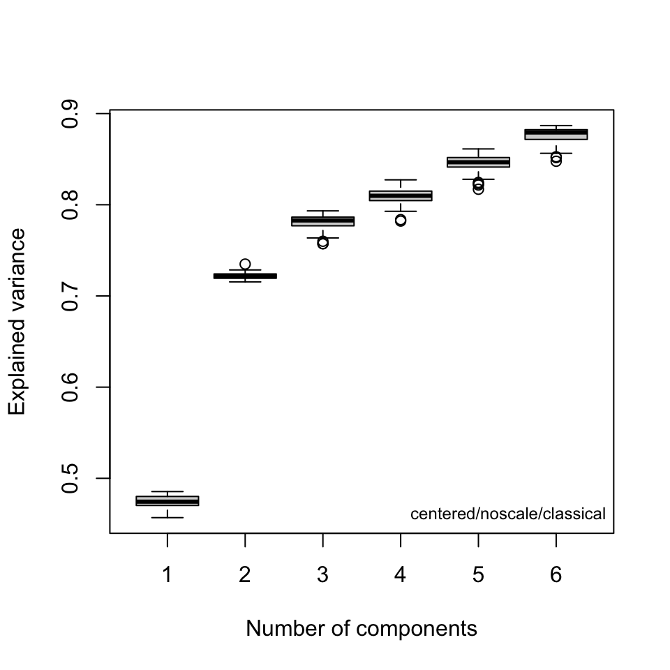
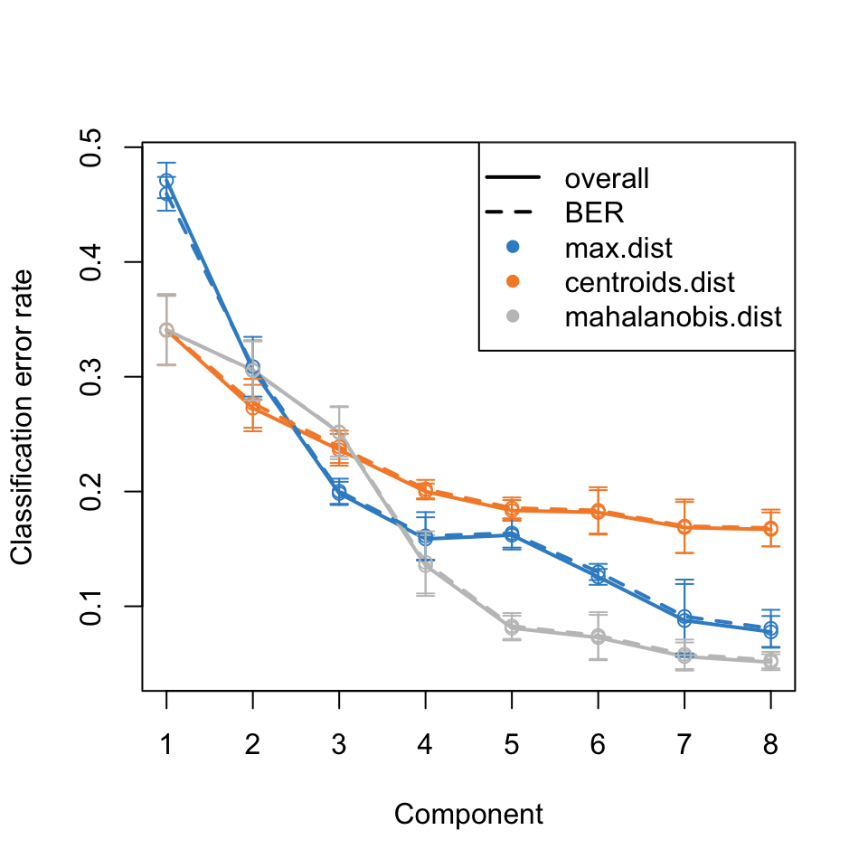

<!-- Run a few things in the background for use later -->

```{r SetUp, echo = FALSE, eval = TRUE, results = "hide", warning = FALSE, message = FALSE}

# R options & configuration:
set.seed(9)
rm(list = ls())
suppressPackageStartupMessages(library("ChemoSpec"))
suppressPackageStartupMessages(library("ggplot2"))
suppressPackageStartupMessages(library("patchwork"))
suppressPackageStartupMessages(library("httr"))
suppressPackageStartupMessages(library("RCurl"))
suppressPackageStartupMessages(library("knitr"))

descCS <- packageDescription("ChemoSpec")
descCSU <- packageDescription("ChemoSpecUtils")

options(ChemoSpecGraphics = "ggplot2")

# Stuff specifically for knitr:

# Create a temp bib file w/citations of installed pkgs, on the fly
knitr::write_bib(c("mixOmics", "bootsPLS"), file = "manuals.bib", prefix = "R_")

# Hook for figure size control
knitr::opts_hooks$set(sq.fig = function(options) {

  if (isFALSE(options$sq.fig)) {
    # custom fig dimensions given, use w/o further delay
    if ((!is.null(options$fig.width)) & (!is.null(options$fig.height))) return(options)
    # otherwise set the default wide aspect ratio
    if ((is.null(options$fig.width)) & (is.null(options$fig.height))) {
      options$fig.width = 6
      options$fig.height = 3.5
    }
  }

  if (isTRUE(options$sq.fig)) {
    options$fig.width = 5
    options$fig.height = 5
  }
  options
})

# choices here are designed to work with the hook
knitr::opts_chunk$set(fig.align = "center", sq.fig = FALSE, tidy = TRUE,
  fig.width = NULL, fig.height = NULL, out.width = "80%",
  cache = TRUE)

```

```{r helperFunctions, echo = FALSE}
#'
#' Download a Single CSV File from Github
#' From https://stackoverflow.com/a/14441835
#' @param url Character.  A valid url to a Github *raw* csv file.
#' @param dots Additional arguments to be passed to `read.table`.
#' @return A data frame, unless the url is unreachable, in which case `NA`.
#'
get_one_csv_from_github <- function(url, ...) {
  code <- status_code(GET(url))
  if (code != 200L) {
    warning("Can't reach the url")
    return(NA)
  }
  raw <- getURL(url)
  data <- read.table(text = raw, ...)
}

#'
#' Download Multiple CSV Files from Github
#'
#' @param url Character.  A vector of valid urls to Github *raw* csv files.
#' @param dots Additional arguments to be passed to `read.table`.
#' @return A list of data frames, unless the url is unreachable, in which the element is `NULL`.
#'
get_csvs_from_github <- function(urls, ...) {
  require("RCurl")
  require("httr")
  nurl <- length(urls)
  ans <- vector("list", nurl)
  for (i in 1:nurl) ans[[i]] <- get_one_csv_from_github(urls[i], ...)
  names(ans) <- basename(urls)
  ans
}
```

This vignette was created using `ChemoSpec` version `r descCS$Version` and `ChemoSpecUtils` version `r descCSU$Version`.

If you aren't familiar with `ChemoSpec`, you may wish to look at the introductory vignette before tackling this one.

# Introduction

@Blaise2021 have published a detailed protocol for metabolomic phenotyping.  This vignette will follow their analysis closely to demonstrate how to carry it out using `ChemoSpec`.  The data is composed of 139 ^1^H HR-MAS SS-NMR spectra [@Blaise2007] of the model organism *Caenorhabditis elegans*.  There are two genotypes, wild type and a mutant, and worms from two life stages.

**This vignette follows the published protocol closely in order to illustrate how to implement the protocol using `ChemoSpec`. As in any chemometric analysis, there are decisions to be made about how to process the data. In this vignette we are interested in which functions to use, and how to look at the results.  We are not trying to analyze the data in a truly rigorous way, do not consider all possible data processing choices, and argument choices are likely not optimized. **

# Preliminaries

**If you only want to study the workflow, you can skip this first section.**

## Import the Data

The data set is large, over 30 Mb, so we will grab it directly from the Github repo where it is stored.  We will use a custom function to grab the data (you can see the function in the source for this document if interested).  The URLs point to the frequency scale, the raw data matrix and the variables that describe the sample classification by genotype and life stage (L2 are gravid adults, L4 are larvae).

```{r getData}
urls <- c("https://raw.githubusercontent.com/Gscorreia89/chemometrics-tutorials/master/data/ppm.csv", "https://raw.githubusercontent.com/Gscorreia89/chemometrics-tutorials/master/data/X_spectra.csv", "https://raw.githubusercontent.com/Gscorreia89/chemometrics-tutorials/master/data/worm_yvars.csv")
raw <- get_csvs_from_github(urls, sep = ",") # a list of data sets
names(raw)
```

```{r checkRaw, echo = FALSE}
proceed <- TRUE
if (any(is.na(raw))) proceed <- FALSE
```

## Construct the Spectra Object

As provided in the Github repo, the format of the data is not really suited to using either of the built-in import functions in `ChemoSpec`.  Therefore we will construct the `Spectra` object by hand, a useful exercise in its own right.  The requirements for a `Spectra` object are described in `?Spectra`.

### Process the Raw Data

First, we'll take the results in `raw` and convert them to the proper form.  Each element of `raw` is a data frame.

```{r processRaw}
# frequencies are in the 1st list element
freq <- unlist(raw[[1]], use.names = FALSE)

# intensities are in the 2nd list element
data <- as.matrix(raw[[2]])
dimnames(data) <- NULL # remove the default data frame col names
ns <- nrow(data)

# get genotype & lifestage, recode into something more readible
yvars <- raw[[3]]
names(yvars) <- c("genotype", "stage")
yvars$genotype <- ifelse(yvars$genotype == 1L, "WT", "Mut")
yvars$stage <- ifelse(yvars$stage == 1L, "L2", "L4")
table(yvars) # quick look at how many in each group
```

### Assemble the Spectra Object

Next we'll construct some useful sample names, create the groups vector, assign the colors and symbols, and finally put it all together into a `Spectra` object.

```{r assemble}
# build up sample names to include the group membership
sample_names <- as.character(1:ns)
sample_names <- paste(sample_names, yvars$genotype, sep = "_")
sample_names <- paste(sample_names, yvars$stage, sep = "_")
head(sample_names)

# use the sample names to create the groups vector
grp <- gsub("[0-9]+_", "", sample_names) # remove 1_ etc, leaving WT_L2 etc
groups <- as.factor(grp)
levels(groups)

# set up the colors based on group membership
data(Col12) # see ?colorSymbol for a swatch
colors <- grp
colors <- ifelse(colors == "WT_L2", Col12[1], colors)
colors <- ifelse(colors == "WT_L4", Col12[2], colors)
colors <- ifelse(colors == "Mut_L2", Col12[3], colors)
colors <- ifelse(colors == "Mut_L4", Col12[4], colors)

# set up the symbols based on group membership
sym <- grp # see ?points for the symbol codes
sym <- ifelse(sym == "WT_L2", 1, sym)
sym <- ifelse(sym == "WT_L4", 16, sym)
sym <- ifelse(sym == "Mut_L2", 0, sym)
sym <- ifelse(sym == "Mut_L4", 15, sym)
sym <- as.integer(sym)

# set up the alt symbols based on group membership
alt.sym <- grp
alt.sym <- ifelse(alt.sym == "WT_L2", "w2", alt.sym)
alt.sym <- ifelse(alt.sym == "WT_L4", "w4", alt.sym)
alt.sym <- ifelse(alt.sym == "Mut_L2", "m2", alt.sym)
alt.sym <- ifelse(alt.sym == "Mut_L4", "m4", alt.sym)

# put it all together; see ?Spectra for requirments
Worms <- list()
Worms$freq <- freq
Worms$data <- data
Worms$names <- sample_names
Worms$groups <- groups
Worms$colors <- colors
Worms$sym <- sym
Worms$alt.sym <- alt.sym
Worms$unit <- c("ppm", "intensity")
Worms$desc <- "C. elegans metabolic phenotyping study (Blaise 2007)"
class(Worms) <- "Spectra"
chkSpectra(Worms) # verify we have everything correct
sumSpectra(Worms)
```

Let's look at one sample from each group to make sure everything looks OK (Figure \@ref(fig:samplePlot)).  At least these four spectra look good.

```{r samplePlot, fig.cap = "Sample spectra from each group."}
p <- plotSpectra(Worms, which = c(35, 1, 34, 2), lab.pos = 7.5, offset = 0.008, amplify = 35, yrange = c(-0.05, 1.1))
p
```

# Data Analysis

We will follow the steps described in the protocol closely.

## Normalization & Scaling

Use PQN normalization; scaling in `ChemoSpec` is applied at the PCA stage (next).

```{r norm}
Worms <- normSpectra(Worms) # PQN is the default
```

## PCA

Conduct classical PCA after applying Pareto scaling.  Note that `ChemoSpec` includes several different variants of PCA.  See the introductory vignette for more details.

```{r pca}
c_pca <- c_pcaSpectra(Worms)
```

### Components to Retain

A key question at this stage is how many components are needed to describe the data set.  Keep in mind that this depends on the choice of scaling.  Figures \@ref(fig:screeAlt) and \@ref(fig:screeTrad) are two different types of scree plots, which give the residual variance.  This is the R^2^~x~ value in the protocol (see protocol figure 7a).  Another approach to answering this question is to do a cross-validated PCA.  The results are shown in Figure \@ref(fig:cv-pca).  These are the Q^2^~x~ values in protocol figure 7a.  All of these ways of looking at the variance explained suggest that retaining three or possibly four PCs is adequate.

```{r screeAlt, fig.cap = "Scree plot (recommended style)."}
plotScree(c_pca)
```

```{r screeTrad, fig.cap = "Scree plot (traditional style)."}
plotScree(c_pca, style = "trad")
```

```{r cv-pca-code, eval = FALSE}
cv_pcaSpectra(Worms, pcs = 6)
```

```{r cv-pca, echo = FALSE, fig.cap = "Cross-validated PCA."}
# The code to make this figure is a bit slow, so including
# a static version

```

### Score Plots

Next, examine the score plots (Figures \@ref(fig:scores12), \@ref(fig:scores23)).  In these plots, each data point is colored by its group membership (keep in mind this has nothing to do with the PCA calculation).  In addition, robust confidence ellipses are shown for each group.  Inspection of these ellipses is one way to identify potential outliers.  Note that the protocol recommends plotting Hotelling's *T*^2^ ellipse for the entire data set; this is not implemented in `ChemoSpec`.

Inspection of these plots shows that the age of the worms (L2 vs L4) has more of an effect than than the genotype (WT vs Mut). In Figure \@ref(fig:scores12) we don't really see any serious outlier candiates.  However, in Figure \@ref(fig:scores23) we do see some candiates, especially for the L2 group along PC3 (two samples in particular; in the protocol they remove five samples).

```{r scores12, sq.fig = TRUE, fig.cap = "Score plot for PCs 1 and 2."}
p <- plotScores(Worms, c_pca, pcs = 1:2, ellipse = "rob")
p
```

```{r scores23, sq.fig = TRUE, fig.cap = "Score plot for PCS 2 and 3."}
p <- plotScores(Worms, c_pca, pcs = 2:3, ellipse = "rob", leg.loc = list(x = 0.85, y = 0.3), tol = 0.02)
p
```

To identify which samples are outliers, you can either increase the value of the argument `tol`, or change the graphics mode to `plotly` which gives an interactive plot where the cursor will identify the sample names (see `?GraphicsOptions`). TODO: not true!

### Outliers

Another way to identify outliers is to use the approach described in @Filzmoser2009 section 3.7.3.  Figures \@ref(fig:diagOD) and  \@ref(fig:diagSD) give the plots. Please see Filzmoser for the details, but any samples that are above the plotted threshold line are candidate outliers, and any samples above the threshold in *both* plots should be looked at very carefully.  Though we are not doing it here, Filzmoser recommends using these plots with robust PCA.

```{r diagOD, sq.fig = TRUE, fig.cap = "Orthogonal distance plot based on the first three PCs."}
p <- pcaDiag(Worms, c_pca, plot = "OD")
p <- p + coord_cartesian(ylim = c(0.0475, 0.0530))
p
```

```{r diagSD, sq.fig = TRUE, fig.cap = "Score distance plot based on the first three PCs."}
p <- pcaDiag(Worms, c_pca, plot = "SD")
p
```

Analysis of these plots suggest that samples 1, 37, 40, 101 and 107 are likely outliers.  They can be removed as follows.[^1]

```{r removeOutliers}
Worms <- removeSample(Worms,
  rem.sam = c("1_", "37_", "40_", "101_", "107_"))
```

At this point one should probably repeat the PCA, score plots and diagnostic plots to get a good look at how removing these samples affected things, but to save space those tasks are left to the reader.

One thing the protocol does not explicitly discuss is an inspection of the loadings.  This is useful in order to see if any particular frequencies are driving the separation of the samples in the score plot. For the sake of completeness, we'll go ahead and plot the loadings. See Figure \@ref(fig:loadings). From this plot it is clear that the peaks above $\delta$ 5.0 are not contributing much to differentiating the samples.  One could consider removing these peaks from the analysis, but we'll leave them for now.

```{r loadings, sq.fig = TRUE, fig.cap = "Loadings for PC1 and PC2."}
p <- plotLoadings(Worms, c_pca, loads = 1:2)
p
```

## Supervised Analysis with PLS-DA

`ChemoSpec` carries out exploratory data analysis, which is an unsupervised process.  The next step in the protocol is PLS-DA (partial least squares - discriminant analysis). I have written about `ChemoSpec` + PLS [here](https://chemospec.org/2021/02/08/p17/) if you would like more background on plain PLS. However, PLS-DA is a technique that combines data reduction/variable selection along with classification.

For the sake of speed (and with some scientific basis, see Figure \@ref(fig:loadings)), we will discard the data above $\delta = 5.0$ which roughly halves the size of the data set.

```{r fremove}
Worms <- removeFreq(Worms, rem.freq = 5.0 ~ high)
sumSpectra(Worms)
```

We'll need the `mixOmics` package (@R_mixOmics) package for this analysis; note that loading it replaces the `plotLoadings` function from `ChemoSpec`.

```{r load-mixOmics}
library("mixOmics")
```

Figure \@ref(fig:plsda-plotIndiv) shows a score plot; the results indicate that classification and modeling may be successful.  The `splsda` function carries out a single *sparse* computation. One computation should not be considered the ideal answer; a better approach is to use cross-validation, for instance `function` in the `bootsPLS` package (@R_bootsPLS which uses `splsda` under the hood).  However, that computation is too time-consuming to demonstrate here.


```{r plsda}
X <- Worms$data
Y <- Worms$groups
splsda <- splsda(X, Y, ncomp = 8)
```

```{r plsda-plotIndiv, warning = FALSE, fig.cap = "sPLS-DA plot showing classification."}
plotIndiv(splsda, col.per.group = c("#FB0D16FF", "#FFC0CBFF", "#511CFCFF", "#2E94E9FF"), title = "sPLS-DA Score Plot", legend = TRUE, ellipse = TRUE)
```

To estimate the number of components needed, the `perf` function can be used. The results are in Figure \@ref(fig:plsda-perf) and suggest that five components are sufficient to describe the data.

```{r plsda-perf-calc, eval = FALSE}
set.seed(123)
perf.splsda <- perf(splsda, folds = 5, nrepeat = 5)
plot(perf.splsda)
```

```{r plsda-perf, echo = FALSE, sq.fig = TRUE, fig.cap = "Classification error rate."}
# The code to make this figure is a bit slow, so including
# a static version

```

At this point, we have a quick sense of how this might go.  Going forward, one might choose to focus on accurate classification, or on determining which frequencies should be included in a predictive model.  Any model will need to refined and more details extracted.  The reader is referred to the case study from the [mixOmics](http://mixomics.org/case-studies/splsda-srbct/) folks which covers these tasks and explains the process.

# References

[^1]: Removing candidate outliers is an area where you need to be very careful.  If we were actually trying to reach an answer we could trust, I would recommend using `r_pcaSpectra`, the robust version of PCA, to help guide the choices.
